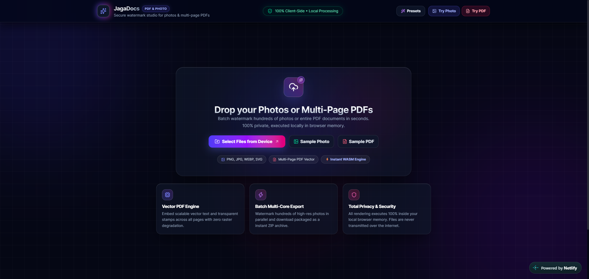
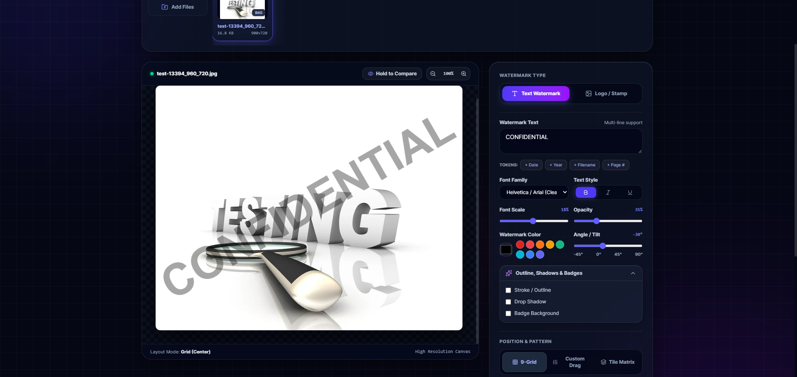

# JagaDocs — PDF & Photo Watermark Studio

[](LICENSE)
[](https://react.dev/)
[](https://www.typescriptlang.org/)
[](https://tailwindcss.com/)
[](#-privacy--security-guarantee)

**JagaDocs** is a modern, high-performance, spatial glassmorphism client-side web application for batch watermarking photos, images, and multi-page PDF documents. All processing executes 100% locally in browser memory — no documents, photos, or confidential data ever leave your machine.

---

## 📸 Interface & Preview

<p align="center">
  
</p>
<p align="center"><em>1. Drop zone and instant sample loader supporting multi-page PDFs and batch photos.</em></p>

<br/>

<p align="center">
  
</p>
<p align="center"><em>2. Real-time watermark studio with interactive canvas, token parser, typography controls, and 9-grid/tile positioning.</em></p>

---

## 🌟 Key Features

### 📄 Multi-Page PDF Watermarking
- **Pure Client-Side Engine**: Built on `pdf-lib` and `pdfjs-dist` — zero server uploads, 100% privacy and security for sensitive legal and financial documents.
- **Selective Page Ranges**: Watermark *All Pages*, *First Page Only*, *Last Page Only*, or a *Custom Range* (e.g., `1, 3-5, 8`).
- **High-Fidelity Vector Embedding**: Embeds crisp vector text and transparent PNG/JPG logo stamps directly into PDF content streams with accurate rotation, opacity, and coordinate mapping.
- **Live Page Navigator**: Inspect individual pages with real-time watermark preview before exporting.

### 🖼️ High-Resolution Photo & Image Processing
- **Format Support**: PNG, JPG, JPEG, WEBP, SVG, GIF, BMP.
- **Lossless Canvas Rendering**: Preserves original image aspect ratios and dimensions without downsampling.
- **Batch Processing & Multi-File Queue**: Process hundreds of images simultaneously.
- **Instant ZIP Packaging**: Download individual files or export all watermarked files at once as an organized `.zip` archive via `JSZip` and `file-saver`.

### ✍️ Dual Watermark Engines

#### 1. Text Watermark Mode
- **Multi-Line Text**: Full multi-line input with automatic text bounding and line-height spacing.
- **Dynamic Token Placeholders**:
  - `{date}` — Formatted local date (`YYYY-MM-DD`)
  - `{year}` — Current year (`YYYY`)
  - `{filename}` — Name of the active file being watermarked
  - `{page}` — Current PDF page number
  - `{totalPages}` / `{total_pages}` — Total page count of the document
- **Typography Controls**:
  - Font families: Helvetica/Arial, Times New Roman, Georgia, Courier New, Impact, Trebuchet MS, Verdana.
  - Font size scale (% of canvas dimension or fixed point size).
  - Bold, Italic, and Underline toggle options.
- **Color & Opacity**: 32-bit hex color palette, custom color picker, and alpha opacity slider (5% to 100%).
- **Rotation Angle**: -180° to +180° rotation with 1-click snap buttons (-45°, 0°, 45°, 90°).
- **Advanced Effects**:
  - **Stroke / Text Outline**: Customizable outline color and line thickness.
  - **Drop Shadow**: Customizable shadow color, offset, and gaussian blur radius.
  - **Badge Background**: Rounded badge container box behind text with custom background color, opacity, padding, and corner radius.

#### 2. Logo / Image Stamp Mode
- **Transparent Stamp Support**: Upload custom PNGs with transparency, high-res SVGs, or JPG logos.
- **Scale Control**: Smooth scale slider from 5% to 90% relative to document dimensions.
- **Independent Opacity & Rotation**: Fine-tune transparency and tilt angles.

### 🎯 Layout & Positioning Modes
1. **9-Grid Preset Matrix**: Instant 1-click snapping to Top-Left, Top-Center, Top-Right, Center-Left, Center, Center-Right, Bottom-Left, Bottom-Center, and Bottom-Right.
2. **Interactive Drag & Custom Coordinate Slider**: Click and drag directly on the preview canvas to freely reposition watermarks with real-time coordinate percentage feedback.
3. **Repeated Tile Matrix**: Security tile pattern repeating across the entire canvas with customizable horizontal gap, vertical gap, and staggered diagonal offset.

### 🔍 Interactive Real-Time Preview
- **Real-Time Render Canvas**: Instant visual feedback as you adjust sliders or switch files.
- **Zoom & Pan Controls**: Zoom In, Zoom Out, and 1-Click Reset (100%).
- **"Hold to Compare" Button**: Instant toggle between the original unwatermarked file and the watermarked preview.
- **Quick Style Presets**: 1-click presets for common workflows (*Confidential Red Diagonal*, *Draft Subtle*, *Copyright Notice*, *Security Tile Pattern*, *Artist Signature*, *Sample Overlay*).

---

## 🔒 Privacy & Security Guarantee

All image manipulation and PDF page transformations execute **100% inside your local browser memory** using HTML5 Canvas and WebAssembly.

- ❌ No server uploads
- ❌ No database storage
- ❌ No telemetry tracking on uploaded document contents
- ✅ Completely offline capable after initial page load

---

## 🛠️ Technology Stack

| Layer | Technology |
|---|---|
| **UI Framework** | [React 19](https://react.dev/) + [TypeScript](https://www.typescriptlang.org/) |
| **Build Tool** | [Vite 8](https://vitejs.dev/) |
| **Styling** | [Tailwind CSS v4](https://tailwindcss.com/) with Spatial Glassmorphism Design |
| **Icons** | [Lucide React](https://lucide.dev/) |
| **PDF Manipulation** | [pdf-lib](https://pdf-lib.js.org/) |
| **PDF Preview** | [pdfjs-dist](https://mozilla.github.io/pdf.js/) |
| **Archive & Export** | [JSZip](https://stuk.github.io/jszip/) + [FileSaver](https://github.com/eligrey/FileSaver.js/) |
| **Feedback FX** | [canvas-confetti](https://www.kirilv.com/canvas-confetti/) |

---

## 🚀 Getting Started

### Prerequisites
- Node.js (v18 or higher recommended)
- npm or pnpm / yarn

### 1. Clone the Repository
```bash
git clone https://github.com/your-username/jagadocs.git
cd jagadocs
```

### 2. Install Dependencies
```bash
npm install
```

### 3. Start Development Server
```bash
npm run dev
```
Open [http://localhost:5173](http://localhost:5173) in your browser.

### 4. Build for Production
```bash
npm run build
```
The optimized production bundle will be created in the `dist/` directory.

### 5. Preview Production Build
```bash
npm run preview
```

---

## 📂 Project Structure

```
jagadocs/
├── docs/                         # Documentation screenshots & application previews
│   ├── landing-preview.png       # Landing and upload dropzone view
│   └── editor-preview.png        # Watermark editor and preview canvas view
├── src/
│   ├── components/
│   │   ├── Header.tsx            # Navigation, branding & 1-click preset selector
│   │   ├── FileUploader.tsx      # Drag & drop upload area with sample loaders
│   │   ├── FileList.tsx          # Carousel queue for multi-file batch editing
│   │   ├── PreviewCanvas.tsx     # Zoomable canvas viewport with drag repositioning
│   │   ├── WatermarkControls.tsx # Text, logo, typography & positioning sidebar
│   │   └── ExportSection.tsx     # Batch ZIP packaging & progress status dock
│   ├── types/
│   │   └── watermark.ts          # Complete TypeScript types & configuration models
│   ├── utils/
│   │   ├── imageWatermark.ts     # HTML5 Canvas rendering engine for photos
│   │   ├── pdfWatermark.ts       # pdf-lib vector embedding engine for multi-page PDFs
│   │   ├── pdfPreview.ts         # pdfjs-dist page renderer for real-time preview
│   │   ├── exportManager.ts      # Single file & batch ZIP export manager
│   │   ├── tokenParser.ts        # Dynamic token replacement engine ({date}, {page}, etc.)
│   │   ├── presets.ts            # Pre-configured watermark templates
│   │   └── sampleLoader.ts       # Sample photo & 3-page PDF demo generators
│   ├── App.tsx                   # Main application state & spatial layout
│   ├── index.css                 # Spatial glassmorphism, animations & Tailwind v4
│   └── main.tsx                  # Application entry point
├── public/                       # Static assets & PDF.js worker
├── package.json
└── vite.config.ts
```

---

## 📄 License

This project is open source and available under the [MIT License](LICENSE).
